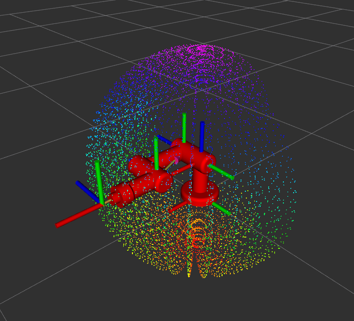
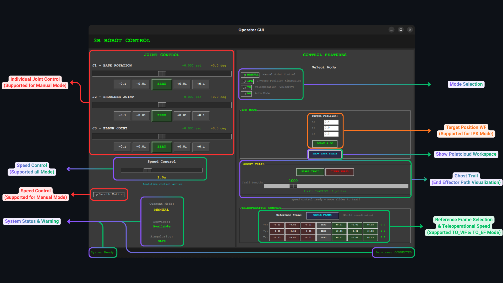
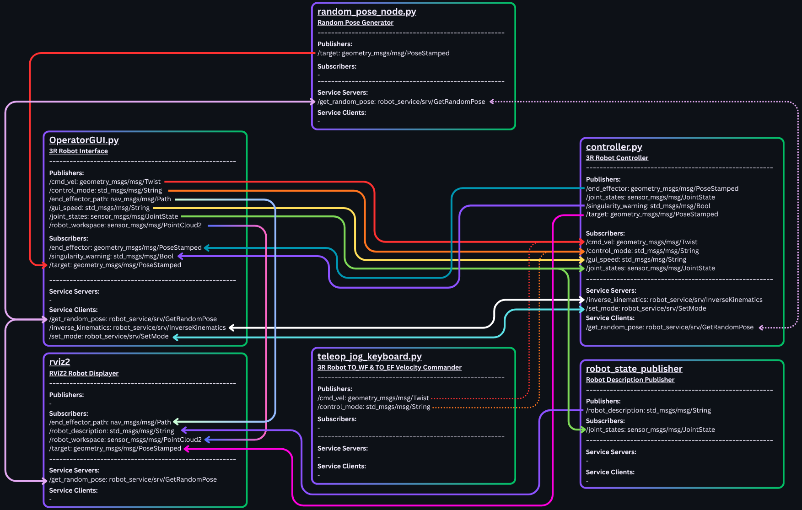

# 3R Robot Control System - Complete Documentation

<div align="center">

**A comprehensive ROS2-based control system for a 3-DOF (3R) robotic manipulator**  
*Featuring multiple control modes, real-time GUI, singularity detection, and advanced safety features*

[](https://docs.ros.org/en/humble/)
[](https://ubuntu.com/)
[](https://www.python.org/)
[](LICENSE)


[Documentation](#table-of-contents) • [Installation](#installation-guide) • [Usage](#usage)

---

</div>


## Table of Contents

1. [Quick Start](#quick-start)
2. [Overview](#overview)
3. [Features](#features)
4. [Installation Guide](#installation-guide)
5. [File Structure](#file-structure)
6. [Usage](#usage)
7. [Keyboard Teleoperation](#keyboard-teleoperation)
8. [Control Modes](#control-modes)
9. [GUI Interface](#gui-interface)
10. [System Architecture](#system-architecture)
11. [Robot Kinematics](#robot-kinematics)
12. [Safety Features](#safety-features)
13. [ROS2 Topics & Services](#ros2-topics--services)
14. [Troubleshooting](#troubleshooting)
15. [Performance Metrics](#performance-metrics)
16. [Advanced Configuration](#advanced-configuration)
17. [License](#license)

---

## Quick Start

### For Experienced Users

```bash
# 1. Install ROS2 Humble
sudo apt update && sudo apt install software-properties-common curl -y
sudo add-apt-repository universe
sudo curl -sSL https://raw.githubusercontent.com/ros/rosdistro/master/ros.key -o /usr/share/keyrings/ros-archive-keyring.gpg
echo "deb [arch=$(dpkg --print-architecture) signed-by=/usr/share/keyrings/ros-archive-keyring.gpg] http://packages.ros.org/ros2/ubuntu $(. /etc/os-release && echo $UBUNTU_CODENAME) main" | sudo tee /etc/apt/sources.list.d/ros2.list > /dev/null
sudo apt update && sudo apt install ros-humble-desktop ros-dev-tools -y

# 2. Install dependencies
sudo apt install python3-pip python3-tk ros-humble-joint-state-publisher ros-humble-robot-state-publisher -y
pip3 install roboticstoolbox-python spatialmath-python scipy matplotlib
pip3 install numpy==1.23.4 --force-reinstall

# 3. Clone and build
cd ~/Desktop
git clone -b LAB4 https://github.com/Whan000/FRA502-LAB-6644.git
cd FRA502-LAB-6644
colcon build
source install/setup.bash

# 4. Add to bashrc
echo "source /opt/ros/humble/setup.bash" >> ~/.bashrc
echo "source ~/Desktop/FRA502-LAB-6644/install/setup.bash" >> ~/.bashrc

# 5. Run
ros2 launch robot_description simple_display.launch.py
```

Done! The GUI and RViz2 will open automatically.

---

## Overview

This project implements a comprehensive control system for a 3-DOF robotic manipulator (3R robot) using ROS2 Humble on Ubuntu 22.04. The system features multiple control modes, a professional graphical user interface, real-time visualization, and advanced safety features.

### Key Highlights

- **4 Control Modes**: Manual, Inverse Kinematics (IPK), Teleoperation (TO), and Autonomous Mode (AM)
- **Real-time GUI**: Professional Tkinter-based operator interface with clean layout
- **High Precision**: 0.1mm tolerance for IPK and TO modes, 2mm for AM mode
- **Speed Control**: Real-time adjustable speed (0.5x to 10x)
- **Safety Systems**: Singularity detection, joint limits
- **RViz2 Integration**: Real-time visualization with ghost trail and target markers
- **Performance**: 90-95% success rate in AM mode, <5% CPU usage

### Robot Specifications


| Parameter | Value |
|-----------|-------|
| Type | 3-DOF RRR manipulator |
| Joint Limits | ±90° (±π/2 rad) all joints |
| Workspace Radius | 0.01m to 0.55m |
| Workspace Height | -0.35m to 0.75m |
| Control Frequency | 1000 Hz |
| Precision | 0.1mm (IPK/TO), 2mm (AM) |

---

## Features

### Control System
- **MANUAL Mode**: Direct joint control via sliders
- **IPK Mode**: Inverse kinematics for position control (0.1mm precision)
- **TO Mode**: Velocity-based teleoperation (World/End-Effector frames)
- **AM Mode**: Autonomous random target reaching with 10s timeout

### Safety & Monitoring
- Real-time singularity detection
- Joint limit enforcement (±90°)

### User Interface
- GUI compatible
- Real-time status displays (mode, services, singularity)
- Speed control slider (0.5x - 10x)
- Reference frame switching (World/End-Effector)
- Ghost trail visualization
- Target position markers

---

## Installation Guide

### Step-by-Step Installation

#### 1. Install Ubuntu 22.04 (If Needed)

If you don't have Ubuntu 22.04:
1. Download from [ubuntu.com](https://ubuntu.com/download/desktop)
2. Create bootable USB and install
3. Update system:
```bash
sudo apt update
sudo apt upgrade -y
```

#### 2. Install ROS2 Humble

```bash
# Enable Ubuntu Universe repository
sudo apt install software-properties-common
sudo add-apt-repository universe

# Add ROS2 GPG key
sudo apt update && sudo apt install curl -y
sudo curl -sSL https://raw.githubusercontent.com/ros/rosdistro/master/ros.key -o /usr/share/keyrings/ros-archive-keyring.gpg

# Add repository to sources
echo "deb [arch=$(dpkg --print-architecture) signed-by=/usr/share/keyrings/ros-archive-keyring.gpg] http://packages.ros.org/ros2/ubuntu $(. /etc/os-release && echo $UBUNTU_CODENAME) main" | sudo tee /etc/apt/sources.list.d/ros2.list > /dev/null

# Update package index
sudo apt update

# Install ROS2 Humble Desktop (includes RViz2)
sudo apt install ros-humble-desktop -y

# Install development tools
sudo apt install ros-dev-tools -y

# Install additional ROS2 packages
sudo apt install ros-humble-joint-state-publisher -y
sudo apt install ros-humble-robot-state-publisher -y
sudo apt install ros-humble-xacro -y

# Set up environment
echo "source /opt/ros/humble/setup.bash" >> ~/.bashrc
source ~/.bashrc

# Verify installation
ros2 --version
```

#### 3. Install Python Dependencies

```bash
# Install pip and Tkinter
sudo apt install python3-pip python3-tk -y

# Install robotics libraries
pip3 install numpy==1.23.4 --force-reinstall
pip3 install roboticstoolbox-python
pip3 install spatialmath-python
pip3 install scipy matplotlib
```

#### 4. Clone Repository

```bash
# Navigate to Desktop
cd ~/Desktop

# Clone repository
git clone -b LAB4 https://github.com/Whan000/FRA502-LAB-6644.git
cd FRA502-LAB-6644
```

#### 5. Build Workspace

```bash
# Build all packages
cd ~/Desktop/FRA502-LAB-6644
colcon build

# Source the workspace
source install/setup.bash

# Add to bashrc for automatic sourcing
echo "source ~/Desktop/FRA502-LAB-6644/install/setup.bash" >> ~/.bashrc

# Verify service interfaces
ros2 interface list | grep robot_service
# Should show:
#   robot_service/srv/SetMode
#   robot_service/srv/InverseKinematics
#   robot_service/srv/GetRandomPose
```

---

## File Structure

```
FRA502-LAB-6644/
├── README.md                           # This file
│
├── src/
│   ├── robot_description/              # Main robot package
│   │   ├── package.xml                 # Package metadata
│   │   ├── CMakeLists.txt              # Build configuration
│   │   │
│   │   ├── robot/
│   │   │   └── visual/
│   │   │       └── 01-myfirst.urdf     # Robot URDF description
│   │   │
│   │   ├── meshes/                     # 3D mesh files
│   │   │   ├── link_0.stl              # Base mesh
│   │   │   ├── link_1.stl              # Link 1 mesh
│   │   │   ├── link_2.stl              # Link 2 mesh
│   │   │   ├── link_3.stl              # Link 3 mesh
│   │   │   └── end_effector.stl        # End-effector mesh
│   │   │
│   │   ├── scripts/                    # Python scripts
│   │   │   ├── controller.py           # Main robot controller
│   │   │   ├── OperatorGUI.py          # Graphical user interface
│   │   │   ├── random_pose_node.py     # Random target generator
│   │   │   └── teleop_jog_keyboard.py  # Keyboard teleoperation
│   │   │
│   │   ├── launch/
│   │   │   └── simple_display.launch.py # System launch file
│   │   │
│   │   ├── config/
│   │   │   └── display.rviz            # RViz configuration
│   │   │
│   │   ├── src/
│   │   │   └── cpp_node.cpp            # C++ node (optional)
│   │   │
│   │   └── include/
│   │       └── robot_description/
│   │           └── cpp_header.hpp      # C++ header (optional)
│   │
│   └── robot_service/                  # Service interface package
│       ├── package.xml                 # Package metadata
│       ├── CMakeLists.txt              # Build configuration
│       ├── LICENSE                     # Service package license
│       └── srv/                        # Service definitions
│           ├── SetMode.srv             # Mode change service
│           ├── InverseKinematics.srv   # IK solver service
│           └── GetRandomPose.srv       # Random pose service
│
├── build/                              # Build files (auto-generated)
├── install/                            # Installation files (auto-generated)
└── log/                                # Log files (auto-generated)
```

### Key Files Explained

| File | Purpose | Lines | Description |
|------|---------|-------|-------------|
| `controller.py` | Main controller | ~560 | Core robot control logic, all 4 modes, kinematics, safety |
| `OperatorGUI.py` | User interface | ~1420 | Tkinter-based GUI, mode selection, real-time control |
| `random_pose_node.py` | Target generator | ~175 | Generate safe random targets for AM mode |
| `teleop_jog_keyboard.py` | Keyboard control | ~300 | WASD keyboard teleoperation |
| `simple_display.launch.py` | Launch file | ~185 | Start entire system with one command |
| `01-myfirst.urdf` | Robot model | - | URDF description with meshes |

---

## Usage

### Method 1: Launch File (Recommended)

Start everything with one command:

```bash
cd ~/Desktop/FRA502-LAB-6644
source install/setup.bash
ros2 launch robot_description simple_display.launch.py
```

This launches:
- Robot State Publisher
- Controller Node
- Random Pose Node
- Operator GUI
- RViz2 Visualization

### Method 2: Manual Start (For Debugging)

Open separate terminals:

**Terminal 1 - Controller:**
```bash
cd ~/Desktop/FRA502-LAB-6644
source install/setup.bash
ros2 run robot_description controller.py
```

**Terminal 2 - GUI:**
```bash
cd ~/Desktop/FRA502-LAB-6644
source install/setup.bash
ros2 run robot_description OperatorGUI.py
```

**Terminal 3 - Random Pose Node:**
```bash
cd ~/Desktop/FRA502-LAB-6644
source install/setup.bash
ros2 run robot_description random_pose_node.py
```

**Terminal 4 - RViz2:**
```bash
cd ~/Desktop/FRA502-LAB-6644
source install/setup.bash
rviz2
```

**Terminal 5 - Keyboard Teleop (Optional):**
```bash
cd ~/Desktop/FRA502-LAB-6644
source install/setup.bash
ros2 run robot_description teleop_jog_keyboard.py
```

### Basic Workflow

1. **Start system** using launch file or manually
2. **Select control mode** in GUI (MANUAL, IPK, TO, or AM)
3. **Control robot** using appropriate interface
4. **Monitor status** in GUI and RViz2
5. **Adjust speed** using speed slider (AM mode)
6. **Stop safely** using ZERO buttons or mode switching

---

## Keyboard Teleoperation

The `teleop_jog_keyboard.py` node provides direct keyboard control for robot teleoperation, offering an alternative to the GUI for velocity-based control in both World Frame and End-Effector Frame modes.

### Features

- **Single Keypress Control**: No need to press Enter - keys respond immediately
- **Dual Frame Support**: Toggle between World Frame (TO_WF) and End-Effector Frame (TO_EF)
- **Real-time Velocity Control**: Smooth velocity adjustment with automatic decay
- **Emergency Stop**: Instant zero velocity with spacebar or '0' key
- **Clean Terminal Display**: Single-line status updates without spam
- **Safety Features**: Velocity limits, automatic decay, and clamping

### Starting Keyboard Teleop

**Method 1: Standalone**
```bash
cd ~/Desktop/FRA502-LAB-6644
source install/setup.bash
ros2 run robot_description teleop_jog_keyboard.py
```

**Method 2: With Full System**
Start in separate terminal after launching main system:
```bash
# Terminal 1: Launch main system
ros2 launch robot_description simple_display.launch.py

# Terminal 2: Start keyboard teleop
ros2 run robot_description teleop_jog_keyboard.py
```

### Keyboard Controls

```
┌─────────────────────────────────────────────────────────────┐
│            TELEOP JOG KEYBOARD CONTROLS                     │
├─────────────────────────────────────────────────────────────┤
│                                                             │
│  Movement Controls:                                         │
│    W / S  → Move ±X direction (forward/backward)            │
│    A / D  → Move ±Y direction (left/right)                  │
│    Q / E  → Move ±Z direction (up/down)                     │
│                                                             │
│  Mode Controls:                                             │
│    F      → Toggle reference frame (WORLD ↔ END_EFFECTOR)   │
│                                                             │
│  Speed Controls:                                            │
│    + / =  → Increase velocity step size                     │ 
│    - / _  → Decrease velocity step size                     │
│                                                             │
│  Safety Controls:                                           │
│    0      → Emergency stop (zero all velocities)            │
│    SPACE  → Emergency stop (zero all velocities)            │
│                                                             │
│  System Controls:                                           │
│    X      → Quit teleop node                                │
│    ESC    → Quit teleop node                                │
│                                                             │
└─────────────────────────────────────────────────────────────┘
```

### Operation Modes

#### World Frame (TO_WF)
Velocities are relative to the robot's base frame:
- **+X**: Move end-effector in global X direction
- **+Y**: Move end-effector in global Y direction  
- **+Z**: Move end-effector in global Z direction

#### End-Effector Frame (TO_EF)
Velocities are relative to the end-effector's current orientation:
- **+X**: Move forward from tool's perspective
- **+Y**: Move left from tool's perspective
- **+Z**: Move up from tool's perspective


### Usage Examples

#### Example 1: Move to Position (World Frame)

```bash
# Start teleop
ros2 run robot_description teleop_jog_keyboard.py

# Ensure in World Frame mode
Press 'f' until status shows "Mode: TO_WF"

# Move forward (+X)
Press 'w' multiple times
# Robot moves in +X direction

# Stop
Press '0' or SPACE
```

#### Example 2: Tool-Relative Movement (End-Effector Frame)

```bash
# Switch to End-Effector Frame
Press 'f' until status shows "Mode: TO_EF"

# Move forward from tool perspective
Press 'w'
# Robot moves forward relative to current tool orientation

# Move up from tool perspective
Press 'q'
# Robot moves up relative to tool frame

# Emergency stop
Press '0'
```

#### Example 3: Precise Control with Speed Adjustment

```bash
# Decrease velocity step for fine control
Press '-' several times
# Velocity step decreases to ~0.005 m/s

# Make fine adjustments
Press 'w' for small +X movement
Press 'a' for small +Y movement

# Increase speed for faster movement
Press '+' several times  
# Velocity step increases to ~0.05 m/s

# Make larger movements
Press 'w' for faster +X movement
```

### Parameters

| Parameter | Default | Range | Description |
|-----------|---------|-------|-------------|
| `velocity_step` | 0.01 m/s | 0.005 - 0.1 m/s | Velocity increment per keypress |
| `max_velocity` | 0.1 m/s | - | Maximum velocity limit |
| `velocity_decay` | 0.85 | 0.0 - 1.0 | Decay factor for safety (85%) |
| `publish_rate` | 20 Hz | - | Velocity publishing frequency |

### Status Display

The terminal shows a single-line status that updates in real-time:

```
Mode: TO_WF   Velocity: [+0.030, -0.010, +0.000]
```

**Display Elements:**
- **Mode**: Current reference frame (TO_WF or TO_EF)
- **Velocity**: [Vx, Vy, Vz] in m/s

### Safety Features

#### Automatic Velocity Decay
Velocities automatically decay by 85% every cycle for safety:
```
Initial velocity: 0.100 m/s
After 1 cycle:   0.085 m/s
After 2 cycles:  0.072 m/s
After 3 cycles:  0.061 m/s
...continues until < 0.001 m/s → stops
```

This prevents runaway motion if keys are released.

#### Velocity Clamping
All velocities are clamped to ±0.1 m/s maximum:
```python
# Even with many keypresses:
Press 'w' 20 times
# Velocity stays at max: 0.100 m/s (not 0.200 m/s)
```

#### Frame Switching Safety
When toggling frames, all velocities are automatically zeroed:
```
Press 'f' to switch frames
→ All velocities reset to [0.0, 0.0, 0.0]
→ Robot stops moving
→ Safe to continue in new frame
```

### Troubleshooting

#### Problem: Keys don't respond

**Solution:**
```bash
# Make sure terminal has focus
# Click on teleop terminal window

# Check if controller is running
ros2 node list | grep controller

# Restart teleop node
Ctrl+C
ros2 run robot_description teleop_jog_keyboard.py
```

#### Problem: Robot moves in wrong direction

**Check:**
1. Verify current frame mode (TO_WF vs TO_EF)
2. Press 'f' to toggle if needed
3. Press '0' to stop, then try again

#### Problem: Movement is too fast/slow

**Solution:**
```bash
# For slower, more precise control:
Press '-' multiple times

# For faster movement:
Press '+' multiple times

# Current step size shown in node logs
```

#### Problem: Robot won't stop

**Solution:**
```bash
# Emergency stop
Press '0' or SPACE immediately

# If still moving:
Press Ctrl+C to kill teleop node
# Velocity will decay automatically
```

### Integration with GUI

The keyboard teleop works alongside the GUI:

**Recommended Workflow:**
1. Start system with launch file (includes GUI)
2. Use GUI to select initial mode (TO mode)
3. Start keyboard teleop in separate terminal
4. Use keyboard for fine control
5. Monitor status in GUI

**Note:** Both GUI (`/gui/cmd_vel`) and keyboard (`/teleop/cmd_vel`) can publish velocity commands simultaneously. The controller uses a priority system where teleop commands override GUI commands.

### Technical Details

**Publishers:**
- `/teleop/cmd_vel` (geometry_msgs/Twist) - Velocity commands at 20 Hz

**Service Clients:**
- `/set_mode` (robot_service/SetMode) - For frame switching

**Control Loop:**
```
User presses key → Update velocity → Publish at 20Hz → Apply decay
                          ↑                              ↓
                          └──────── Continuous loop ─────┘
```

**Terminal Setup:**
- Raw input mode (no canonical mode)
- No echo (keypresses not shown)
- Single character read (no Enter needed)
- Restored on exit


### Example Session

```bash
$ ros2 run robot_description teleop_jog_keyboard.py

                TELEOP JOG KEYBOARD CONTROL              
                     TO_WF + TO_EF SUPPORT                        

CONTROLS: w/s(±X) a/d(±Y) q/e(±Z) f(toggle) +/-(speed) 0(stop) x(quit) 

Press keys for immediate control:
Mode: TO_WF   Velocity: [+0.000, +0.000, +0.000]

# Press 'w' → Status updates:
Mode: TO_WF   Velocity: [+0.010, +0.000, +0.000]

# Press 'a' → Status updates:
Mode: TO_WF   Velocity: [+0.010, +0.010, +0.000]

# Press '0' → Stop:
Mode: TO_WF   Velocity: [+0.000, +0.000, +0.000]

# Press 'f' → Toggle frame:
Mode: TO_EF   Velocity: [+0.000, +0.000, +0.000]

# Press 'x' → Quit:

Teleop stopped.
```

---

## Control Modes

### 1. MANUAL Mode

Direct joint angle control using sliders.

**Features:**
- 3 joint sliders (J1, J2, J3)
- Real-time singularity monitoring
- Smooth motion movement (Optional)
- Range: ±90° per joint

**Usage:**
1. Click "MANUAL" button
2. Move joint sliders to desired positions
3. Robot moves in real-time
4. Monitor singularity status (SAFE/WARNING)

### 2. IPK Mode (Inverse Position Kinematics)

Position-based control using Cartesian coordinates.

**Features:**
- Target position entry (X, Y, Z)
- Automatic IK solving
- 0.1mm precision tolerance
- Workspace visualization

**Usage:**
1. Click "IPK" button
2. Enter target position:
   - X: -0.55 to 0.55 m
   - Y: -0.55 to 0.55 m
   - Z: -0.35 to 0.75 m
3. Click "SOLVE & GO"
4. Robot moves to target (stops within 0.1mm)

**Example:**
```
Target: x=0.3, y=0.2, z=0.4
Result: Robot reaches (0.3000, 0.2000, 0.4000) ±0.1mm
```

### 3. TO Mode (Teleoperation)

Velocity-based control in World or End-Effector frame.

**Features:**
- Velocity control (Vx, Vy, Vz)
- Reference frame switching
- Joint limit protection

**Frames:**
- **WORLD FRAME (TO_WF)**: Velocities relative to base frame
- **EE FRAME (TO_EF)**: Velocities relative to end-effector frame

**Usage:**
1. Click "TO" button
2. Select frame:
   - Click "WORLD FRAME" for base coordinates
   - Click "EE FRAME" for tool coordinates
3. Control velocity:
   - Click +0.01 / -0.01 to add/subtract velocity
   - Click ZERO to reset axis
4. Robot moves continuously
5. Click ZERO on all axes to stop

**Velocity Range:** ±0.1 m/s per axis

### 4. AM Mode (Autonomous Mode)

Automatic random target reaching with timeout.

**Features:**
- Random target generation
- Real-time speed control (0.1x - 3.0x)
- 10-second timeout per target
- 2mm tolerance
- Stuck detection (10s) with auto-recovery

**Usage:**
1. Click "AM" button
2. Adjust speed slider (optional)
3. Robot automatically:
   - Requests random target
   - Moves to target
   - Repeats continuously
4. Click different mode to stop


---

## GUI Interface

### Layout



### Interactive Elements

**Sliders:**
- Joint control (J1, J2, J3)
- Speed control (0.1x to 3.0x)
- Smooth motion

**Buttons:**
- Mode selection: MANUAL, IPK, TO_WF, TO_EF, AM
- IPK: SOLVE & GO, SHOW TASK SPACE
- Velocity: +0.01, -0.01, ZERO (×3 axes)
- Ghost trail: START, STOP, CLEAR
- Frame: WORLD FRAME / EF FRAME

**Status Displays:**
- Current mode indicator
- Services availability (Available/Not Available)
- Singularity warning (SAFE/WARNING in red)
- Velocity values (Vx, Vy, Vz)
- Speed multiplier (0.1x - 3.0x)

---

## System Architecture

### High-Level Architecture


```
┌─────────────────────────────────────────────────────────────┐
│                         User Layer                          │
├─────────────────────────────────────────────────────────────┤
│  GUI (Tkinter)          Keyboard           RViz2            │
│  • Mode selection       • WASD keys        • Visualization  │
│  • Controls             • Frame switch     • Ghost trail    │
│  • Status               • Direct control   • Markers        │
└────────────┬────────────────┬──────────────────┬────────────┘
             │                │                  │
             ▼                ▼                  ▼
┌─────────────────────────────────────────────────────────────┐
│                  ROS2 Communication Layer                   │
├─────────────────────────────────────────────────────────────┤
│  Topics:                    Services:                       │
│  • /joint_states            • /set_mode                     │
│  • /gui/cmd_vel             • /inverse_kinematics           │
│  • /teleop/cmd_vel          • /get_random_pose              │
│  • /gui/joint_commands                                      │
│  • /end_effector                                            │
│  • /random_pose/target                                      │
│  • /singularity_warning                                     │
│  • /gui_speed                                               │
└────────────┬────────────────┬──────────────────┬────────────┘
             │                │                  │
             ▼                ▼                  ▼
┌─────────────────────────────────────────────────────────────┐
│                      Control Layer                          │
├─────────────────────────────────────────────────────────────┤
│  Controller             Random Pose Node                    │
│  • Mode management      • Target generation                 │
│  • Kinematics          • Safety filtering                   │
│  • Safety checks                                            │
│  • Motion control                                           │
└────────────┬────────────────────────────────────────────────┘
             │
             ▼
┌─────────────────────────────────────────────────────────────┐
│                      Robot Layer                            │
├─────────────────────────────────────────────────────────────┤
│  Robot Model (roboticstoolbox)                              │
│  • DH parameters                                            │
│  • Forward kinematics                                       │
│  • Inverse kinematics                                       │
│  • Jacobian calculation                                     │
└─────────────────────────────────────────────────────────────┘
```

### Data Flow

```
User Input → GUI → ROS2 Services → Controller → Robot Model
                                         │
                                         ├→ Forward Kinematics
                                         ├→ Inverse Kinematics
                                         ├→ Jacobian Calculation
                                         ├→ Singularity Check
                                         └→ Motion Control
                                                 │
                                                 ▼
                                         Joint States Published
                                                 │
                                                 ▼
                                         RViz2 + GUI Update
```

---

## Robot Kinematics

### DH Parameters (Modified DH Convention)

| Link | α (alpha) | a     | d     | offset | qlim        |
|------|-----------|-------|-------|--------|-------------|
| 1    | 0         | 0     | 0.2   | 0      | [-π/2, π/2] |
| 2    | π/2       | 0     | 0.12  | 0      | [-π/2, π/2] |
| 3    | 0         | 0.25  | -0.1  | 0      | [-π/2, π/2] |
| Tool | -         | 0.28  | 0     | -      | -           |

### Forward Kinematics

```
T_base_to_ee = T₀₁(q₁) × T₁₂(q₂) × T₂₃(q₃) × T_tool

Position: p = [x, y, z]ᵀ = T[0:3, 3]
Rotation: R = T[0:3, 0:3]
```

**Implementation:**
```python
fk_pose = self.robot.fkine(self.q)
position = fk_pose.t  # [x, y, z]
rotation = fk_pose.R  # 3×3 matrix
```

### Inverse Kinematics

**Method:** Levenberg-Marquardt numerical optimization

**Implementation:**
```python
solution = self.robot.ikine_LM(
    target_pose,
    q0=self.q,              # Initial guess
    mask=[1, 1, 1, 0, 0, 0] # Position only
)

if solution.success:
    joint_angles = solution.q
```

### Jacobian

**Position Jacobian (3×3):**
```
J_trans = | ∂x/∂q₁  ∂x/∂q₂  ∂x/∂q₃ |
          | ∂y/∂q₁  ∂y/∂q₂  ∂y/∂q₃ |
          | ∂z/∂q₁  ∂z/∂q₂  ∂z/∂q₃ |
```

**Velocity Mapping:**
```
[vₓ]              [q̇₁]
[vᵧ] = J_trans × [q̇₂]
[vᵣ]              [q̇₃]
```

**Inverse:**
```
[q̇₁]                    [vₓ]
[q̇₂] = J_trans⁻¹ × [vᵧ]
[q̇₃]                    [vᵣ]
```

### Manipulability

**Yoshikawa's Index:**
```
μ = √det(J_trans × J_transᵀ)
```

**Singularity Detection:**
```
if μ < 0.001:
    Singularity detected
    Stop motion
    Warn user
```

**Implementation:**
```python
J = self.robot.jacob0(self.q)
J_trans = J[0:3, :]
manipulability = np.sqrt(np.linalg.det(J_trans.T @ J_trans))

if manipulability < 1e-3:
    return True  # In singularity
```

---

## Safety Features

### 1. Singularity Detection

**System:**
- Continuous monitoring at 1000 Hz
- Manipulability threshold: < 0.001
- Immediate check on mode change

**Warnings:**
```
# Entering singularity:
WARNING: Robot approaching singularity - cannot continue (manipulability: 0.000987)

# Exiting singularity:
Robot cleared singularity region (manipulability: 0.001234)
```

**Actions:**
- Motion stops automatically
- GUI shows "WARNING"

**Recovery:**
1. Switch to MANUAL mode
2. Move joints away from singular configuration
3. Resume normal operation

### 2. Joint Limits


**Enforcement:**
```
q_min = [-π/2, -π/2, -π/2]
q_max = [π/2, π/2, π/2]
new_q = np.clip(new_q, q_min, q_max)
```

### 3. Velocity Limiting

**Limits:**
- Teleoperation: ±0.1 m/s
- Joint velocity: configurable
- Maximum joint step: 0.1 rad/iteration

**Safety:**
- Gradual acceleration/deceleration
- Velocity decay

### 4. Timeout Protection (AM Mode)

**System:**
- 10-second timeout per target
- Stuck detection (10 seconds)
- Automatic recovery
- New target request

**Behavior:**
```
Target assigned at t=0
if position_error < 0.002 within 10s:
    Success → Request new target
else:
    Timeout → Request new target
```

---

## ROS2 Topics & Services

### Published Topics


| Topic | Type | Rate | Publisher | Description |
|-------|------|------|-----------|-------------|
| `/joint_states` | `sensor_msgs/JointState` | 1000 Hz | Controller | Current joint positions/velocities |
| `/end_effector` | `geometry_msgs/PoseStamped` | 1000 Hz | Controller | End-effector pose |
| `/random_pose/target` | `geometry_msgs/PoseStamped` | On change | RandomPoseNode | Target position for AM mode |
| `/singularity_warning` | `std_msgs/Bool` | 1000 Hz | Controller | Singularity status (True/False) |
| `/end_effector_path` | `nav_msgs/Path` | 10 Hz | GUI | Ghost trail path |
| `/gui_speed` | `std_msgs/String` | On change | GUI | Speed multiplier |
| `/gui/cmd_vel` | `geometry_msgs/Twist` | 20 Hz | GUI | GUI velocity commands (TO mode) |
| `/teleop/cmd_vel` | `geometry_msgs/Twist` | 20 Hz | TeleopKeyboard | Keyboard velocity commands (TO mode) |
| `/gui/joint_commands` | `sensor_msgs/JointState` | On change | GUI | Joint position commands (MANUAL mode) |

### Subscribed Topics

| Topic | Type | Subscriber | Description |
|-------|------|------------|-------------|
| `/gui/cmd_vel` | `geometry_msgs/Twist` | Controller | GUI velocity commands |
| `/teleop/cmd_vel` | `geometry_msgs/Twist` | Controller | Keyboard velocity commands |
| `/gui/joint_commands` | `sensor_msgs/JointState` | Controller | Joint position commands from GUI |
| `/gui_speed` | `std_msgs/String` | Controller | Speed control from GUI |
| `/singularity_warning` | `std_msgs/Bool` | GUI | Singularity warnings display |
| `/random_pose/target` | `geometry_msgs/PoseStamped` | GUI | Target position display |

### Velocity Command Priority

When both GUI and keyboard teleop publish velocity commands simultaneously, the controller uses a priority system:
1. **Teleop keyboard** (`/teleop/cmd_vel`) - Highest priority
2. **GUI** (`/gui/cmd_vel`) - Lower priority

If teleop velocity is non-zero, it overrides GUI velocity. GUI velocity is only used when teleop velocity is zero.

### Services

| Service | Type | Description |
|---------|------|-------------|
| `/set_mode` | `robot_service/SetMode` | Change control mode [AM, IPK, TO_EF, TO_WF, MANUAL] |
| `/inverse_kinematics` | `robot_service/InverseKinematics` | Solve IK for target pose |
| `/get_random_pose` | `robot_service/GetRandomPose` | Request random safe target |

### Service Definitions

**SetMode.srv:**
```
string mode    # "MANUAL", "IPK", "TO_WF", "TO_EF", "AM"
---
bool success   # Success status
string message # Status message
```

**InverseKinematics.srv:**
```
geometry_msgs/Pose target_pose  # Target in Cartesian pose
---
bool success                     # Solution found
float64[] joint_positions        # Joint angles [J1, J2, J3]
string message                   # Status message
```

**GetRandomPose.srv:**
```
bool request
---
bool success                     # Generation success
geometry_msgs/Pose target_pose  # Generated pose
string message                   # Status message
```

### Topic Message Examples

**joint_states:**
```yaml
header:
  stamp: {sec: 1234, nanosec: 567890000}
  frame_id: 'link_0'
name: ['joint_1', 'joint_2', 'joint_3']
position: [0.5, -0.3, 0.7]  # radians
velocity: [0.0, 0.0, 0.0]
effort: []
```

**gui/cmd_vel or teleop/cmd_vel:**
```yaml
linear:
  x: 0.01  # m/s in X direction
  y: 0.0   # m/s in Y direction
  z: 0.0   # m/s in Z direction
angular:
  x: 0.0
  y: 0.0
  z: 0.0
```

**singularity_warning:**
```yaml
data: true   # True = WARNING, False = SAFE
```

---

## Troubleshooting

### Installation Issues

#### Problem: "ros2: command not found"

**Solution:**
```bash
source /opt/ros/humble/setup.bash
# Add to bashrc:
echo "source /opt/ros/humble/setup.bash" >> ~/.bashrc
source ~/.bashrc
```

#### Problem: "ModuleNotFoundError: No module named 'robot_service'"

**Solution:**
```bash
cd ~/Desktop/FRA502-LAB-6644
colcon build --packages-select robot_service
source install/setup.bash
```

#### Problem: "ModuleNotFoundError: No module named 'roboticstoolbox'"

**Solution:**
```bash
pip3 install roboticstoolbox-python spatialmath-python
```

#### Problem: Tkinter not found

**Solution:**
```bash
sudo apt install python3-tk
```

### Runtime Issues

#### Problem: Controller won't start

**Solution:**
```bash
# Check if services are built
ros2 interface list | grep robot_service

# If not found:
cd ~/Desktop/FRA502-LAB-6644
colcon build
source install/setup.bash
```

#### Problem: GUI doesn't appear

**Solution:**
```bash
# Check if Tkinter is installed
python3 -c "import tkinter"

# If error:
sudo apt install python3-tk

# Run GUI manually
ros2 run robot_description OperatorGUI.py
```

#### Problem: Robot won't move in TO mode

**Possible Causes:**
1. At singularity
2. At workspace boundary
3. No velocity commands

**Solution:**
```bash
# Check terminal for warnings
# If singularity:
1. Switch to MANUAL mode
2. Move joints away from 0° (singular)
3. Switch back to TO mode

# If at boundary:
1. Move in opposite direction
2. Return to safe workspace
```

#### Problem: "Services not available" in GUI

**Solution:**
```bash
# Make sure controller is running FIRST
ros2 run robot_description controller.py

# Wait 2-3 seconds
# Then start GUI
ros2 run robot_description OperatorGUI.py
```

#### Problem: Robot oscillates or "jiggles"

**Solution:**
```bash
# Stop end_effector_publisher if running
# It conflicts with controller

# Edit launch file to comment out end_effector_node
# Or run only controller + GUI without launch file
```

### Performance Issues


#### Problem: AM mode timeout too fast

**Solution:**
```python
# Edit controller.py
# Find timeout value (around line 355):
timeout = 10.0  # Change to 15.0 or 20.0
```

### Common Error Messages

| Error | Cause | Solution |
|-------|-------|----------|
| "Services not available" | Controller not running | Start controller first |
| "Robot won't move" | Singularity/boundary | Check warnings, move away |
| "Import errors" | Workspace not sourced | `source install/setup.bash` |
| "Node not found" | Scripts not executable | `chmod +x *.py` |

---

### Tolerance Comparison

| Mode | Tolerance |
|------|-----------|
| MANUAL | Varies |
| IPK | 0.1 mm |
| TO | 0.1 mm |
| AM | 2.0 mm |

---

## Advanced Configuration

### Adjustable Parameters

Edit `controller.py` to modify:

**Speed Settings (Lines ~26-34):**
```python
self.declare_parameter('am_speed_multiplier', 1.0)  # Default speed
self.declare_parameter('am_max_joint_step', 0.60)   # Max velocity
```

**Workspace Limits (Lines ~35-38):**
```python
self.declare_parameter('r_min', 0.010)   # Min radius (m)
self.declare_parameter('r_max', 0.550)   # Max radius (m)
self.declare_parameter('z_min', -0.350)  # Min height (m)
self.declare_parameter('z_max', 0.750)   # Max height (m)
```

**Tolerances:**
```python
# IPK tolerance (line ~310):
if position_error > 0.0001:  # 0.1mm

# AM tolerance (line ~381):
if position_error < 0.002:  # 2mm
```

**Singularity Threshold (line ~530):**
```python
def check_singularity_and_warn(self, manipulability_threshold=1e-3):
    # Lower threshold = more sensitive
    # Higher threshold = less sensitive
```


---

---

## License

This project is licensed under the MIT License.

```
MIT License

Copyright (c) 2024 [Phuriwat Kasamesookphaisal]

Permission is hereby granted, free of charge, to any person obtaining a copy
of this software and associated documentation files (the "Software"), to deal
in the Software without restriction, including without limitation the rights
to use, copy, modify, merge, publish, distribute, sublicense, and/or sell
copies of the Software, and to permit persons to whom the Software is
furnished to do so, subject to the following conditions:

The above copyright notice and this permission notice shall be included in all
copies or substantial portions of the Software.

THE SOFTWARE IS PROVIDED "AS IS", WITHOUT WARRANTY OF ANY KIND, EXPRESS OR
IMPLIED, INCLUDING BUT NOT LIMITED TO THE WARRANTIES OF MERCHANTABILITY,
FITNESS FOR A PARTICULAR PURPOSE AND NONINFRINGEMENT. IN NO EVENT SHALL THE
AUTHORS OR COPYRIGHT HOLDERS BE LIABLE FOR ANY CLAIM, DAMAGES OR OTHER
LIABILITY, WHETHER IN AN ACTION OF CONTRACT, TORT OR OTHERWISE, ARISING FROM,
OUT OF OR IN CONNECTION WITH THE SOFTWARE OR THE USE OR OTHER DEALINGS IN THE
SOFTWARE.
```

---


## Acknowledgments

- **ROS2 Community** for excellent documentation
- **Peter Corke** for Robotics Toolbox

---
**Version**: 1.0
